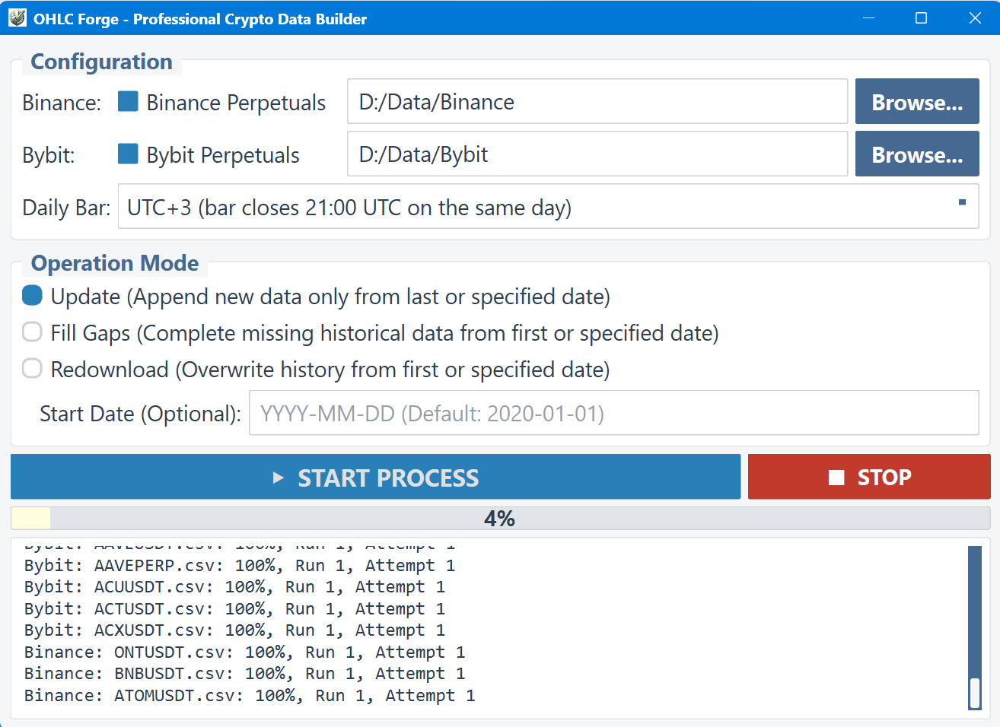
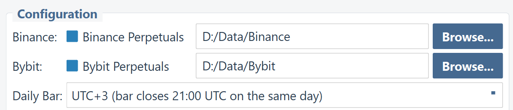
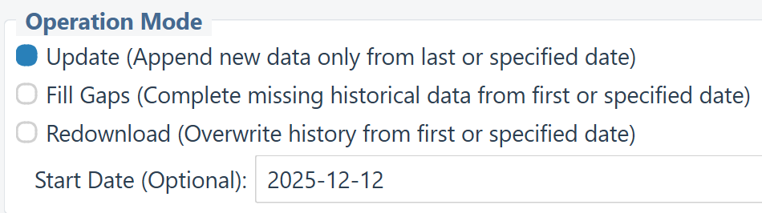
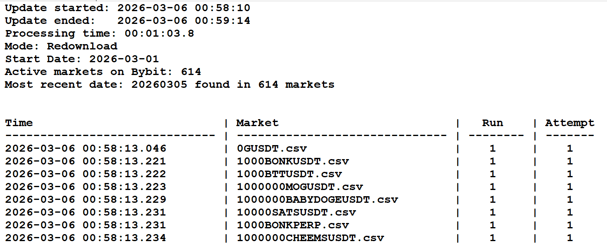

# OHLC Forge PRO
# Daily Bars for Crypto Perpetuals in Your Time Zone

Build the entire historical daily data database for Bybit and Binance perpetual markets and set your own session open and close times.



### Precise Configuration
Choose from **40 different time zone offsets** (from UTC-20 to UTC+20) to perfectly match your local evening routine.



### Three Operation Modes
Seamlessly update your database with missing bars, fill historical gaps, or perform a full redownload from a specific date.



### High-Quality CSV Output
OHLC Forge generates clean, standard CSV files compatible with **AmiBroker, TradingView, Excel, Python (Pandas)**, and any other technical analysis software. All prices are formatted with a fixed number of decimal places, strictly following the market specification (tick size). The application retrieves the official tick size (price precision) from each exchange and formats all prices accordingly.

**📈 High-Price Market (BTC)**  
Bitcoin trades with **1 decimal place** precision:
```csv
20251201,90308.6,90374.4,83755.3,86244.1,12214858119
20251202,86244.1,92298.9,86148.4,91241.7,9616542596
20251203,91241.7,94189.4,90945.0,93390.1,9571207300
20251204,93390.1,94058.1,90800.0,92031.8,6933686131
20251205,92031.8,92658.3,88002.1,89273.7,8427872957
```

**💎 Low-Price Market (Meme Coin)**  
Markets like 1000000BABYDOGEUSDT use **7 decimal places**:
```csv
20251201,0.0006972,0.0006982,0.0006300,0.0006585,1068182
20251202,0.0006585,0.0007163,0.0006510,0.0007028,859501
20251203,0.0007028,0.0007599,0.0007028,0.0007516,1067822
20251204,0.0007516,0.0007654,0.0007113,0.0007137,573909
```

### Professional Update Logs
Monitor your download progress, API rate limits, and network connection status in real-time through a clear, professional text log.



---

## 🎯 The Problem with Default Daily Bars

Most cryptocurrency exchanges close their daily candles at **00:00 UTC**. This is an international standard, but it creates a real problem for systematic traders who need to update their data and place orders every day.

*   🌙 **Default: UTC+0**
    *   **00:00 - 02:00**
    *   Daily bar closes at **midnight UTC**
    *   *For most traders, this means staying up late at night or waking up in the middle of the night to update data and place orders.*

*   ✨ **Custom Time Zone**
    *   **21:00 - 22:00**
    *   Daily bar closes at **your chosen time**
    *   *Update your data, place your orders, and go to bed at a reasonable hour. Same trading system, same logic, better lifestyle.*

---

## 🌍 Real Examples: Traders Around the World

See how the default 00:00 UTC close time affects traders in different locations, and how **OHLC Forge** solves this problem:

###  Hans from Berlin (Germany, CET = UTC+1)
*   **Default UTC+0:** `01:00` (middle of the night)
*   **With OHLC Forge:** `22:00` (relaxed evening)
> *"I was setting alarms for 1 AM every night. Now I update my data at 10 PM and sleep well."*
> **Recommended: UTC+3**

###  Wei from Shanghai (China, CST = UTC+8)
*   **Default UTC+0:** `08:00` (morning rush hour)
*   **With OHLC Forge:** `21:00` (calm evening)
> *"An 8 AM bar close meant rushing before work. Now I trade comfortably after dinner."*
> **Recommended: UTC+11**

###  Emma from Auckland (New Zealand, NZDT = UTC+13 in summer)
*   **Default UTC+0:** `13:00` (lunch at work)
*   **With OHLC Forge:** `22:00` (home sweet home)
> *"I couldn't check my system during my lunch break at work. Evening trading changed everything."*
> **Recommended: UTC+15**

###  Mike from Los Angeles (USA West Coast, PST = UTC-8)
*   **Default UTC+0:** `16:00` (still at work)
*   **With OHLC Forge:** `21:00` (evening at home)
> *"Default close time was during my commute. Now I trade after putting the kids to bed."*
> **Recommended: UTC-5**

---

## 📋 Quick Reference: Time Zone Settings

Find your location and recommended setting for evening (21:00–22:00) data updates:

| Location | Local Offset | Default Close (00:00 UTC) | Problem | Recommended Setting | New Close (Local Time) |
| :--- | :--- | :--- | :--- | :--- | :--- |
| <br>**Berlin** | UTC+1 / +2 | 01:00 / 02:00 | 🌙 Middle of night | **UTC+3** | ✨ 22:00 / 23:00 |
| <br>**London** | UTC+0 / +1 | 00:00 / 01:00 | 🌙 Midnight | **UTC+2** | ✨ 22:00 / 23:00 |
| <br>**Beijing** | UTC+8 | 08:00 | 🏃 Morning rush | **UTC+11** | ✨ 21:00 |
| <br>**Tokyo** | UTC+9 | 09:00 | 💼 Work hours | **UTC+12** | ✨ 21:00 |
| <br>**Wellington** | UTC+12 / +13 | 12:00 / 13:00 | 🍽️ Lunch break | **UTC+15** | ✨ 21:00 / 22:00 |
| <br>**Sydney** | UTC+10 / +11 | 10:00 / 11:00 | 💼 Work hours | **UTC+13** | ✨ 21:00 / 22:00 |
| <br>**Los Angeles** | UTC-8 / -7 | 16:00 / 17:00 | 💼 Still at work | **UTC-5** | ✨ 21:00 / 22:00 |
| <br>**New York** | UTC-5 / -4 | 19:00 / 20:00 | 🍽️ Dinner time | **UTC-2** | ✨ 21:00 / 22:00 |
| <br>**São Paulo** | UTC-3 | 21:00 | ✓ Already good! | **UTC+0** | ✨ 21:00 |

> ⚠️ **Important: UTC Offsets Are Fixed, Your Local Time Changes**
> The time zone settings in OHLC Forge (e.g., UTC+3) are **fixed UTC offsets**, not dynamic time zones that adjust for Daylight Saving Time (DST). The daily bar always closes at exactly the same moment in UTC. However, your local clock time for that moment will shift by 1 hour when your region switches between standard time and daylight saving time.

---

## ❓ Frequently Asked Questions

### Will my trading system perform differently with custom time zone data?
Results should be **very similar**, though minor differences are expected. The underlying price movements are the same — you're just slicing the 24-hour periods at different points. If your backtest results change *significantly* when shifting the daily bar close time by a few hours, this is a strong indicator that your system may be **overfitted (curve-fitted)**.

### Why do exchanges use UTC+0 by default?
UTC is the international standard for timekeeping. It's neutral and doesn't favour any particular region. However, "neutral" for the world often means "inconvenient" for individual traders.

### Can I use multiple time zone settings for the same symbol?
Yes! OHLC Forge creates separate data files for each exchange. You can run the tool multiple times with different settings and save to different folders.

### What about weekends? Crypto trades 24/7.
Correct — crypto markets never close. Your daily bars will be continuous, including Saturday and Sunday. The time zone setting simply determines when each 24-hour period begins and ends.

### How is this different from simply using exchange data?
Exchange data only provides UTC+0 daily bars (closing at midnight UTC). OHLC Forge downloads hourly data and reconstructs daily bars according to your chosen time zone. This is the **only** way to obtain custom time zone daily data for crypto.

---

## ✨ OHLC Forge PRO Features

*   🌐 **40 Time Zones:** From UTC−20 to UTC+20, find the perfect closing time for your schedule.
*   📈 **600+ Pairs:** All perpetual futures from Binance and Bybit in one click.
*   🔧 **3 Modes:** Update, Fill Gaps, or Redownload your data as needed.
*   💾 **CSV Format:** Ready for AmiBroker, TradingView, Excel, Python, and more.
*   ⚡ **Multi-threaded:** Fast parallel downloads — update all pairs in minutes.
*   🖥️ **Easy GUI:** No coding required. Click, configure, download.

---

## 🚀 Ready to Trade on Your Schedule?
Stop staying up late or missing signals. Get daily crypto data that closes when *you* want it to.

### [👉 Get OHLC Forge PRO on Gumroad](https://gumroad.com/l/ohlc-forge)

*One-time purchase • Sold "as is" • 40 time zone options • 600+ crypto pairs*

---

## ⚖️ Legal Disclaimer and Terms of Use

1. **Software Tool Nature:** OHLC Forge PRO is a technical utility designed solely to facilitate the downloading and processing of public market data. It does not contain or distribute any financial market data.
2. **Third-Party Libraries:** The Software utilises the open-source CCXT library to interface with cryptocurrency exchanges.
3. **User-Initiated Data Access:** All data is downloaded directly by the user from third-party exchanges (e.g., Binance, Bybit) using their public APIs.
4. **User Responsibility:** It is your sole responsibility to ensure that your use of these APIs complies with the respective Terms of Service and rate limits.
5. **No Affiliation:** OHLC Forge PRO is an independent software product and is not affiliated with Binance, Bybit, or CCXT.
6. **No Financial Advice & "As Is" Warranty:** This Software is provided "as is". Nothing in this product constitutes financial advice. Past performance does not guarantee future results.
7. **LIMITATION OF LIABILITY:** IN NO EVENT SHALL THE DEVELOPER BE LIABLE FOR ANY DAMAGES ARISING OUT OF OR IN CONNECTION WITH THE USE OF THIS SOFTWARE.


