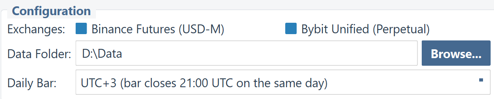
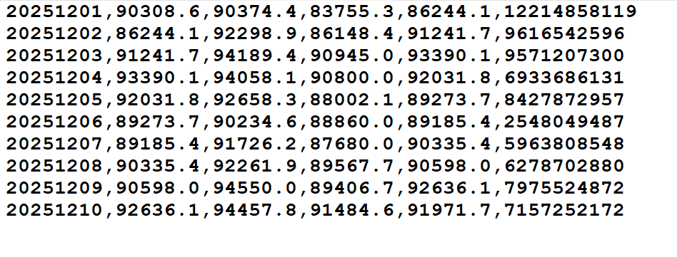

  

# OHLC Forge
### Professional OHLCV Data Reconstruction for Crypto Traders

Build your own historical daily data database for Binance and Bybit perpetual markets with **custom session close times**. No more midnight alarms – trade on your own schedule.

---

## ⚡ Quick Navigation

| [🚀 Get OHLC Forge PRO (Gumroad)](https://gumroad.com/l/ohlc-forge) | [🎁 Download FREE Demo (.exe)](https://github.com/tomkam1702/OHLC-Forge/releases) | [📖 Full User Guide (Online)](https://tomkam1702.github.io/OHLC-Forge/) |
| :--- | :--- | :--- |

---

## 📊 Free vs PRO Comparison

Experience the power of custom time zones. Start with the Free Demo and upgrade when you're ready for the full market.

| Feature | FREE Demo | OHLC Forge PRO |
| :--- | :--- | :--- |
| **Exchanges** | Binance, Bybit | **Binance, Bybit** |
| **Supported Symbols** | BTC/USDT, ETH/USDT | **All (600+) Perpetual Pairs** |
| **Daily Bar Time Zone** | Forced UTC±0 | **40 Options (UTC-20 to UTC+20)** |
| **Reconstruction Method** | Simple 1d Fetch | **Precise 1h Reconstruction** |
| **Operation Modes** | Update, Fill Gaps, Redownload | **Update, Fill Gaps, Redownload** |
| **Multi-threading** | Yes | **Yes (High Performance)** |
| **DPI-Aware UI** | Yes | **Yes** |
| **Commercial Use** | Personal Only | **Professional / Commercial** |

---

## 🎯 The Problem with Default Daily Bars

Most cryptocurrency exchanges close their daily candles at **00:00 UTC**. This is an international standard, but it creates a real problem for systematic traders who need to update their data and place orders every day.

*   🌙 **Default: UTC+0**
    *   Daily bar closes at **midnight UTC**.
    *   *For most European traders, this means 1 AM or 2 AM. For others, it's during the work day.*

*   ✨ **Custom Time Zone (PRO Only)**
    *   Daily bar closes at **your chosen time** (e.g., 22:00 local).
    *   *Update your data, place your orders, and go to bed at a reasonable hour. Same trading system, same logic, better lifestyle.*

---

## 🛠 Precise Configuration & Modes

### Choose Your Offset
Choose from **40 different time zone offsets** (from UTC-20 to UTC+20) in the PRO version to perfectly match your evening routine.

### Three Operation Modes
1. **Update**: Quickly add the latest missing bars to your existing files.
2. **Fill Gaps**: Scan your history and download any missing data points.
3. **Redownload**: Fresh start from any historical date you specify.

---

## 📈 High-Quality CSV Output

OHLC Forge generates clean, standard CSV files compatible with **AmiBroker, TradingView, Excel, Python (Pandas)**, and more. Prices strictly follow the exchange tick size.

### Professional Update Logs
Monitor your download progress, API rate limits, and network connection status in real-time.

---

## 🌍 Real Examples: Traders Around the World

| Location | Local Offset | Default Close (00:00 UTC) | Problem | Recommended Setting | New Close (Local Time) |
| :--- | :--- | :--- | :--- | :--- | :--- |
|  **Berlin** | UTC+1 / +2 | 01:00 / 02:00 | 🌙 Middle of night | **UTC+3** | ✨ 22:00 / 23:00 |
|  **London** | UTC+0 / +1 | 00:00 / 01:00 | 🌙 Midnight | **UTC+2** | ✨ 22:00 / 23:00 |
|  **Los Angeles** | UTC-8 / -7 | 16:00 / 17:00 | 💼 Still at work | **UTC-5** | ✨ 21:00 / 22:00 |
|  **New York** | UTC-5 / -4 | 19:00 / 20:00 | 🍽️ Dinner time | **UTC-2** | ✨ 21:00 / 22:00 |

---

## ❓ Frequently Asked Questions

**How is this different from simply using exchange data?**
Exchange APIs only provide UTC+0 daily bars. OHLC Forge PRO downloads hourly data and **reconstructs** daily bars according to your chosen offset. This is the only way to get true custom-session crypto data.

**Do I need an API key?**
No! OHLC Forge uses public endpoints. You don't need to risk your private API keys.

**Can I update my existing data files?**
Yes. Use the **Update** mode to scan your local CSVs and download only the new missing bars since your last session.

---

## ✨ OHLC Forge PRO Features

*   🌐 **40 Time Zones:** From UTC−20 to UTC+20.
*   📈 **600+ Pairs:** All perpetual futures from Binance and Bybit.
*   🔧 **3 Modes:** Update, Fill Gaps, or Redownload.
*   ⚡ **Multi-threaded:** Fast parallel downloads.
*   🖥️ **GUI:** No coding required.

---

## ⚖️ Legal Disclaimer
OHLC Forge is a technical utility for processing public market data via the CCXT library. It does not provide financial advice. Use at your own risk.

[👉 Get OHLC Forge PRO on Gumroad](https://gumroad.com/l/ohlc-forge)
 IN NO EVENT SHALL THE DEVELOPER BE LIABLE FOR ANY DAMAGES ARISING OUT OF OR IN CONNECTION WITH THE USE OF THIS SOFTWARE.
